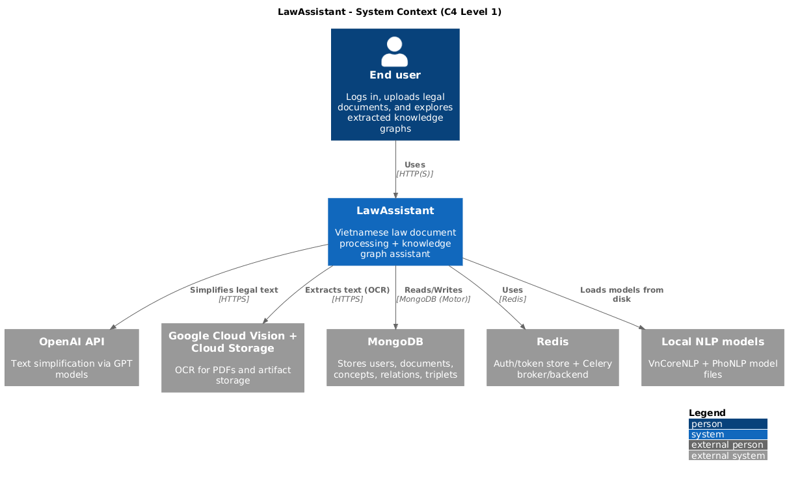
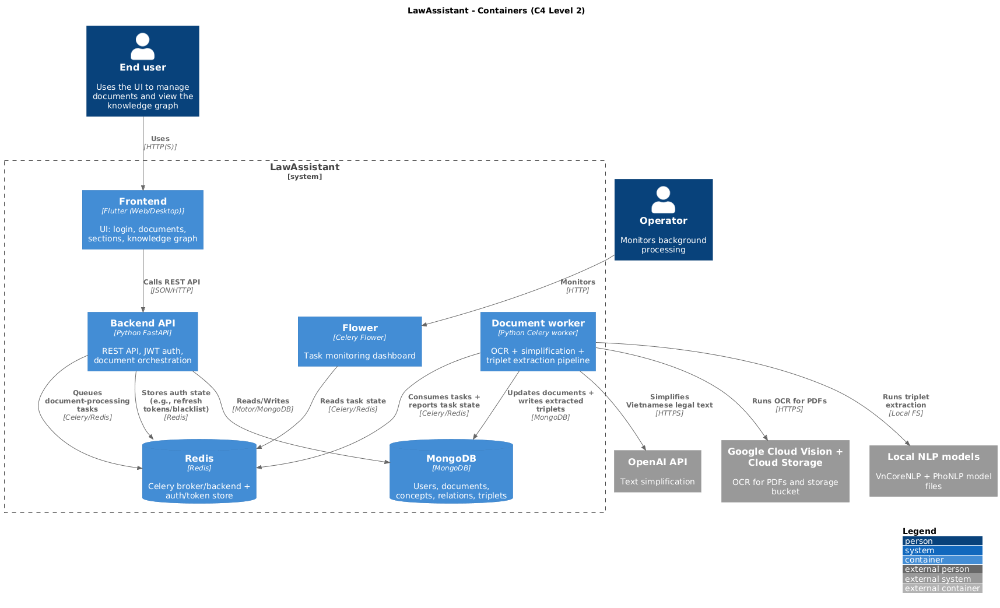
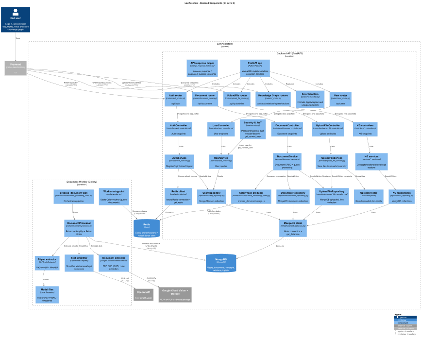
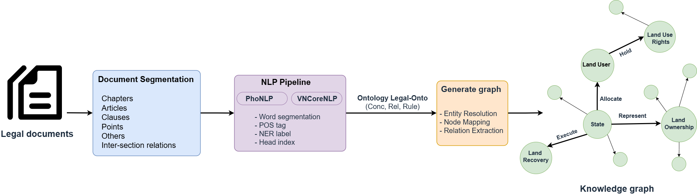

# LawAssistant

End-to-end **Vietnamese legal document assistant**:
- **FastAPI backend** (MongoDB + Redis)
- **Celery worker** for document processing (OCR → simplification → triplet extraction)
- **Flutter frontend** (Web/Desktop UI)

## Diagrams
### System context diagram


### Container diagram


### Component diagram (backend)


### Document processing overview


### Pipeline illustration


## Architecture (high-level)
- **Frontend** (`app/frontend`): Flutter app using Dio to call the backend (`API_BASE_URL` via `--dart-define`).
- **Backend API** (`app/backend/main.py`): manual dependency injection; routers resolve controllers from `app.state`.
- **Worker** (`app/backend/worker`): Celery worker consuming the `documents` queue.
- **Data stores**:
  - MongoDB for users/documents/concepts/relations/triplets
  - Redis for Celery broker/backend and auth-related state

## Prerequisites
- Python 3.10+
- MongoDB + Redis
- Flutter 3+ (with Chrome/web support)
- Credentials & model assets:
  - Google Cloud service account JSON (Vision + Storage)
  - OpenAI API key
  - VNCoreNLP model directory, PhoNLP model directory

## Backend (FastAPI) — `app\backend`
Install dependencies:
```powershell
cd app\backend
python -m venv .venv
.venv\Scripts\activate
pip install -r requirements.txt
```

Create `.env` in `app\backend` (matches `core/config.py`):
```env
# Database
MONGO_URI=mongodb://localhost:27017
DB_NAME=lawassistant

# Auth/JWT
JWT_SECRET_KEY=change-me
JWT_REFRESH_SECRET_KEY=change-me-too
ALGORITHM=HS256
ACCESS_TOKEN_EXPIRE_MINUTES=60
REFRESH_TOKEN_EXPIRE_DAYS=7

# Redis (used by API)
REDIS_HOST=localhost
REDIS_PORT=6379
REDIS_PASSWORD=

# Celery (used by worker/flower)
REDIS_URL=redis://localhost:6379/0

# External services
OPENAI_API_KEY=your-openai-key
OPENAI_MODEL=gpt-4o-mini
GOOGLE_APPLICATION_CREDENTIALS=C:\path\to\gcp-service-account.json
GOOGLE_CLOUD_STORAGE_BUCKET=your-bucket

# NLP model paths (local filesystem)
VNCORENLP_MODEL_PATH=C:\path\to\vncorenlp
PHONLP_MODEL_PATH=C:\path\to\phonlp
```

Run the API:
```powershell
cd app\backend
uvicorn main:app --host 0.0.0.0 --port 8000 --reload
```

Run background processing:
```powershell
cd app\backend
python worker\worker.py                         # Celery worker (queue: documents)
celery --app=core.celery_app flower --port=5555  # optional monitoring UI
```

## Full stack (Docker) — `app\backend\docker-compose.yml`
```powershell
cd app\backend
docker-compose up --build
```

Note: the API uses `REDIS_HOST/REDIS_PORT` (not `REDIS_URL`) for its Redis connection; when running in Docker, ensure your environment points `REDIS_HOST` at the `redis` service.

## Frontend (Flutter) — `app\frontend`
```powershell
cd app\frontend
flutter pub get
flutter run -d chrome --dart-define=API_BASE_URL=http://localhost:8000
```

Useful commands:
```powershell
flutter analyze
flutter test
flutter build web --dart-define=API_BASE_URL=https://api.yourdomain.com
```

## Testing
- Backend: no automated tests currently in the repository.
- Frontend: `flutter test`
