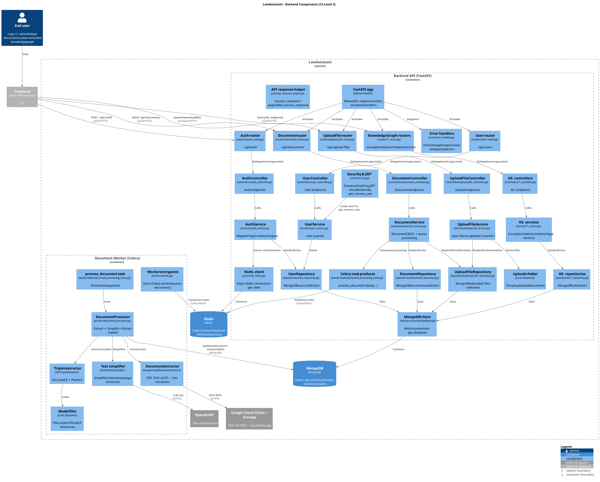

# LawAssistant

LawAssistant is an end-to-end Vietnamese legal document assistant with:
- a FastAPI backend in `app/backend`
- a Celery worker for document processing
- a Flutter frontend in `app/frontend`
- retrieval and knowledge-graph pipelines under `src/`

## Architecture
- Frontend: Flutter web/desktop client calling the backend with `API_BASE_URL`
- Backend API: FastAPI app with manual dependency injection via `app.state`
- Worker: Celery queue for OCR, sentence simplification, and triplet extraction
- Storage:
  - MongoDB for users, documents, concepts, relations, triplets
  - Redis for auth state and Celery broker/backend

## Repository Layout
```text
app/
  backend/    FastAPI API, Celery worker, Docker assets
  frontend/   Flutter application
src/
  retrieval/          retrieval pipeline
  triplet_extraction/ knowledge graph extraction code
  update_pipeline/    batch document ingestion tools
data/         raw and processed legal datasets
docs/         diagrams and project documentation
scripts/      experiments and one-off utilities
```

## Prerequisites
- Python 3.10+
- MongoDB running locally or reachable by connection string
- Redis running locally or reachable by host/port
- Flutter 3+ if you want to run the frontend
- Required external assets for document processing:
  - OpenAI API key
  - Google Cloud service-account JSON for Vision/Storage
  - VNCoreNLP model directory
  - PhoNLP model directory

## Run The Backend Server

### 1. Install backend dependencies
```bash
cd app/backend
python -m venv .venv
source .venv/bin/activate
pip install -r requirements.txt
```

On Windows PowerShell:
```powershell
cd app\backend
python -m venv .venv
.venv\Scripts\Activate.ps1
pip install -r requirements.txt
```

### 2. Create `app/backend/.env`
The backend reads settings from `app/backend/.env` through `core/config.py`.

```env
# Database
MONGO_URI=mongodb://localhost:27017
DB_NAME=lawassistant

# Auth / JWT
JWT_SECRET_KEY=change-me
JWT_REFRESH_SECRET_KEY=change-me-too
ALGORITHM=HS256
ACCESS_TOKEN_EXPIRE_MINUTES=60
REFRESH_TOKEN_EXPIRE_DAYS=7

# Redis used by the FastAPI app
REDIS_HOST=localhost
REDIS_PORT=6379
REDIS_PASSWORD=

# Redis used by Celery / Flower
REDIS_URL=redis://localhost:6379/0

# External services
OPENAI_API_KEY=your-openai-key
OPENAI_MODEL=gpt-4o-mini
GOOGLE_APPLICATION_CREDENTIALS=/absolute/path/to/service-account.json
GOOGLE_CLOUD_STORAGE_BUCKET=your-bucket

# Local NLP assets
VNCORENLP_MODEL_PATH=/absolute/path/to/vncorenlp
PHONLP_MODEL_PATH=/absolute/path/to/phonlp
```

### 3. Start supporting services
Start MongoDB and Redis before the API.

Example with Docker:
```bash
docker run -d --name lawassistant-mongo -p 27017:27017 mongo:7
docker run -d --name lawassistant-redis -p 6379:6379 redis:7-alpine
```

### 4. Start the FastAPI server
```bash
cd app/backend
uvicorn main:app --host 0.0.0.0 --port 8000 --reload
```

If startup succeeds, the server is available at:
- `http://localhost:8000`
- `http://localhost:8000/docs` for Swagger UI
- `http://localhost:8000/redoc` for ReDoc

API routers are mounted under:
- `/api/auth`
- `/api/users`
- `/api/documents`
- `/api/upload-files`
- `/api/concepts`
- `/api/relations`
- `/api/triplets`
- `/api/legal-sections`
- `/api/section-relations`

## Run With Docker
The repository now includes a root-level `docker-compose.yml` for local development.

Start the local stack:
```bash
docker compose up --build
```

This starts:
- MongoDB on `localhost:27017`
- Redis on `localhost:6379`
- FastAPI backend on `http://localhost:8000`
- Flutter web frontend on `http://localhost:3000`

Stop the stack:
```bash
docker compose down
```

If you also want document-processing jobs, start the optional worker profile:
```bash
docker compose --profile worker up --build
```

### Docker environment overrides
The Docker stack provides safe local defaults for the API, but you can override them from your shell before running Compose:

```bash
export DOCKER_OPENAI_API_KEY=your-key
export DOCKER_OPENAI_MODEL=gpt-4o-mini
export DOCKER_GOOGLE_APPLICATION_CREDENTIALS=/opt/credentials/google-service-account.json
export DOCKER_GOOGLE_CLOUD_STORAGE_BUCKET=your-bucket
export DOCKER_VNCORENLP_MODEL_PATH=/opt/models/VnCoreNLP-1.2
export DOCKER_PHONLP_MODEL_PATH=/opt/models/phonlp
export FRONTEND_API_BASE_URL=http://localhost:8000
docker compose up --build
```

The compose file mounts these local folders into the containers:
- `docker/credentials` -> `/opt/credentials`
- `docker/models` -> `/opt/models`

For the worker profile, place your files at:
- `docker/credentials/google-service-account.json`
- `docker/models/VnCoreNLP-1.2/`
- `docker/models/phonlp/`

Use the worker profile only after those files exist and the OpenAI / bucket settings are valid.

## Run Background Processing
Document ingestion and triplet extraction require the Celery worker in addition to the API.

Start the worker from `app/backend`:
```bash
python worker/worker.py
```

Optional Flower dashboard:
```bash
celery --app=core.celery_app flower --port=5555
```

Flower will be available at `http://localhost:5555`.

## Run The Frontend
```bash
cd app/frontend
flutter pub get
flutter run -d chrome --dart-define=API_BASE_URL=http://localhost:8000
```

Useful frontend commands:
```bash
flutter analyze
flutter test
flutter build web --dart-define=API_BASE_URL=https://api.yourdomain.com
```

## Document Ingestion Pipeline
The repository also includes a standalone ingestion flow in `src/update_pipeline`.

Run the GUI mode:
```bash
python src/update_pipeline/add_document_pipeline.py --gui
```

Run the CLI mode:
```bash
python src/update_pipeline/add_document_pipeline.py --cli
```

## Docker Notes
The older `app/backend/docker-compose.yml` is backend-only and incomplete for the full application. Prefer the root `docker-compose.yml` for local work with both backend and frontend.

## Diagrams
### System context


### Container


### Backend components


### Processing overview


### Pipeline illustration


## Testing
- Frontend: `flutter test`
- Backend: no maintained automated test suite is documented in the repository yet
